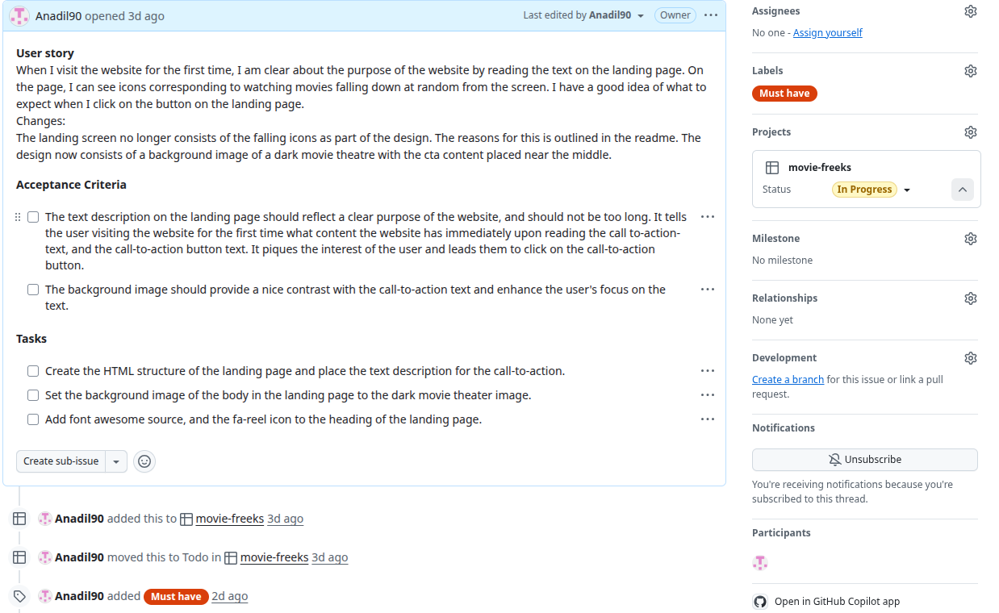
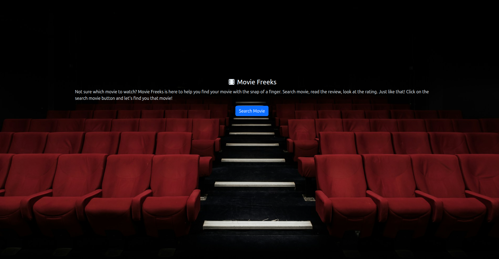
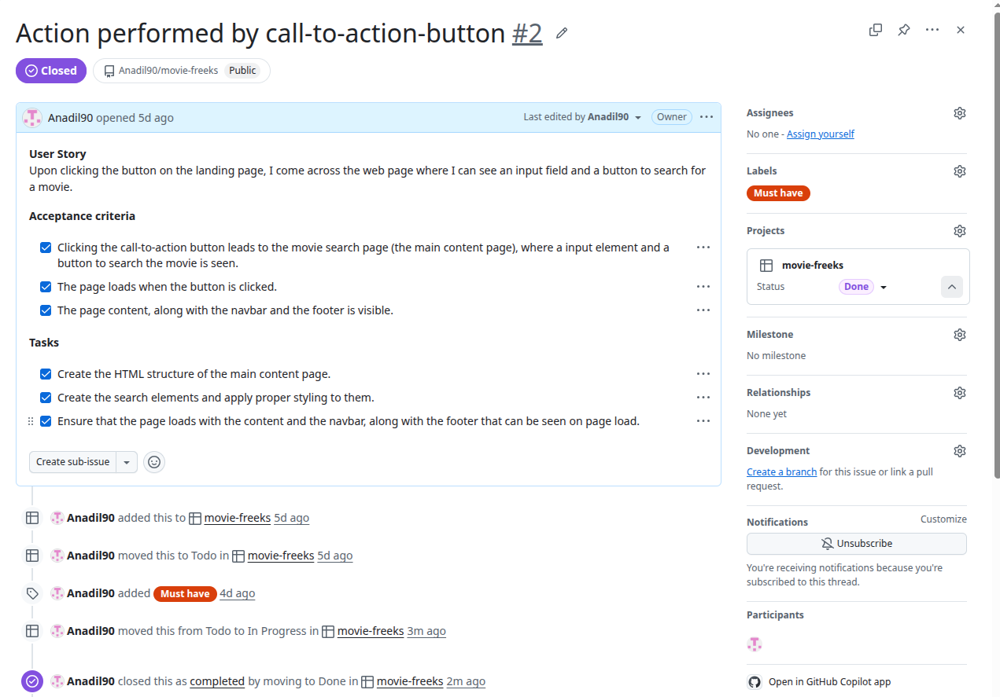
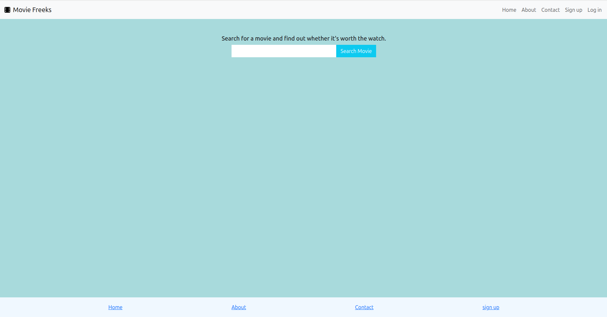
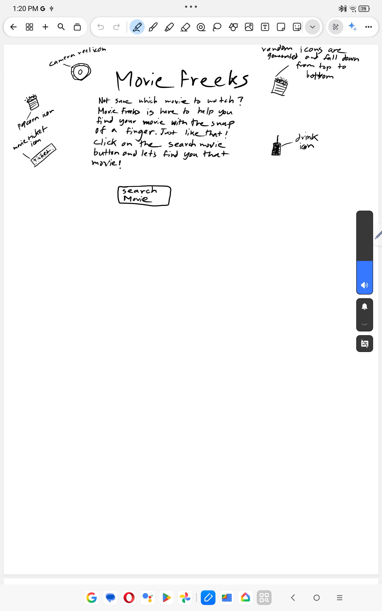
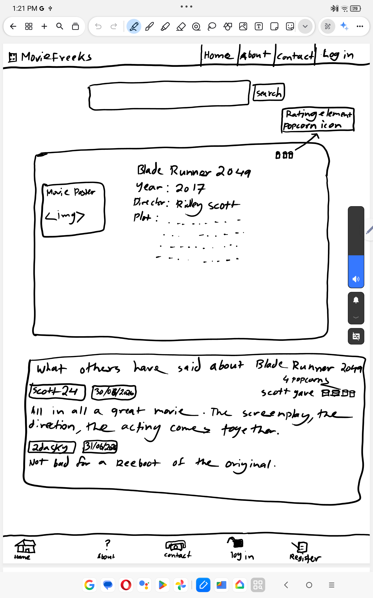
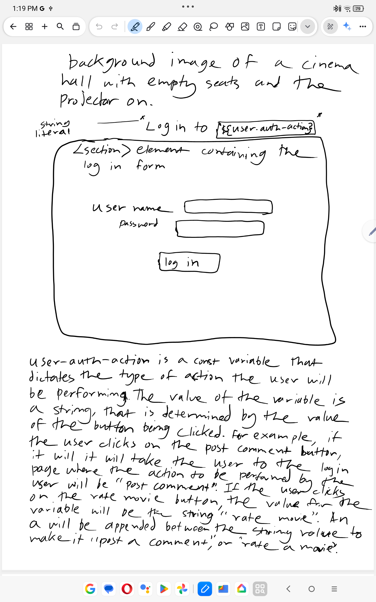
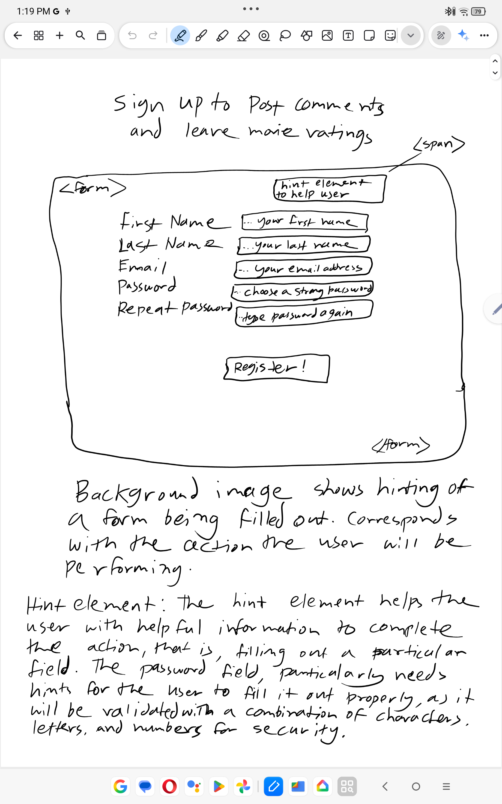

## Movie Freeks
Movie Freeks is a movie review website that aims to present a straightforward and quick way to determine good movies to watch. The user can find out movies worthwhile watching relatively easily owing to the information architechture that aims for the user to quickly take in the information and make a decision.

## Features 
- Users can search for movies and see the corresponding details of the movie, as well the rating for it, presented in a manner that is clear and easy to understand.  
- A rating system that makes use of effective iconography to let the user know in a flash whether a movie is good or not. The rating system is made to convey to the user a simple "good" or "bad" with the combination of text and icons. Users can log in and rate movies by allocating popcorn icons, the maximum of which is 5, and the minimum of which is 1.
- A pleasing interface that makes use of bold colors and text that best makes an impact upon the user.
- The ability for the users to leave comments on a particular movie review to add their perspective of the movie direction, plot, acting, or other elements.

## Project rationale
The Movie Freeks project has been developed with the aim of offering an interactive movie review website to the users, that helps them to find out quickly and efficiently movies to watch. At its' base, the website is designed to be useful, useable, and provide value to the users, in terms of being quickly being able to find movies to watch without frustrations in the user experience process. In such a website, a lot of information can be provided to the user and be thought of as being useful to the user. But Movie Freeks focuses on keeping information to a minimum point, where will be utilizing the information to make a decision quickly without the need to cross-reference other sources. This is the main goal of the website. As Movie Freeks aims to serve movie enthusiasts as the users of the website, the landing page design has been concieved to be more related to what the word "movies" portay in the minds of individuals in general. This is evident with the call-to-action text and the background of the landing page. Movie Freeks has been developed with the intention of serving users in a production-level environment in the future, with an active development cycle that will on its' many iterations, offer new features and user experience improvements.

## Typography choices 
From reading, it has been found out that Typography plays an important a very crucial role in giving a movie its visual identity. Choosing the right font can result in the right emotions being invoked, the correct tone being set, and a cinematic experience being created that is memorable for the audience. And to do that, selecting the best matching font plays an essential part in creating that asthetical impact, acording to the following source:
(15 Best Font for Movie (update 2026))[https://uicreative.net/blog/best-movie-font.html]. Although this comes from the perspective of movies, it is very closely applicable to the typography choice when working with the mockup UI phase of web development, as evident from the examples shown in the source article. For the global font of the website, a font the likes of Montages Retro Vintage seems very well suited for the look and feel of the website text content, as it strikes a strong feeling of focus and has a bold impact. This is evident through the direct quote from the source: "Montages Retro Vintage Font brings warmth and character to any design, making it an ideal choice for businesses, designers, and creatives looking to capture a timeless and sophisticated vintage look." Direct quote from (15 Best Font for Movie (update 2026))[https://uicreative.net/blog/best-movie-font.html]. It is worth noting that such a font by this name most probably does not exist in google fonts. The google font that most closely matches the said font is Marcellus. The global font chosen therefore is Marcellus, which serves to make an impact on the user. 

For the content page body, the background colour of #A8DADC (light cyan), contrasted with black font colour makes for an appealing look that is easily readable. This has been chosen to be the typography choice for the movie search results page, where the main textual content is to be shown. The navbar background color of #F5E8D8 (warm beige) has been chosen to create a nice contrast from the body, that seems appropriate for the content that the website is catering to the users. This combination of colors has been thought to better draw in the attention of the user to the content due to its' light, yet bold complexion. This color scheme also applies to the about page, due to textual content. The colour hex codes have been sourced from here: [6 Dark Mode Website Color Palette Ideas](https://www.vev.design/blog/dark-mode-website-color-palette/) 

For the landing page, a background image of a dark movie theatre was applied to contrast the call-to-action text. This resulted in an appealing landing page that places the main focus on the call-to-action text owing to the darkened portion of the image serving as a contrast for the text. The font color of aliceblue was applied to create that contrast.

## User stories
1. When I visit the website for the first time, I am clear about the purpose of the website by reading the text on the landing page. On the page, I can see icons corresponding to watching movies falling down at random from the screen. I have a good idea of what to expect next, when I click the button on the landing page.

Note: There has been changes made to this user story, as outlined in the next section in this readme, which is the changes in content/ user story section. 

User story 1 acceptance criteria and tasks

Completed user story

2. Upon clicking the button on the landing page, I come accross the web page where I can see an input field and a button to search for a movie. 

User story 2 acceptance criteria and tasks

Completed user story

3. When I type in the name of the movie and click the search button, it results in the information of the movie showing up almost instantly, and is arranged in a way such that it is easy to get an idea of the movie in a relatively short time. I can see all the relevant information of the movie such as movie title, year released, director, and plot. I am not provided with too much information, such that I need a bit of time to go through it, which leads to information overload.
4. When the search results for the movie being searched for loads, I can also see the corresponding rating for the movie that helps to make a clearer decision in terms of whether to watch it, or not.
5. I can see a button to log in, and when I click on it, I am able to log in using my credentials to the main page to search for movie reviews. Besides using the button to log in, when I click on the rate movie button, I am taken to the page to log in and I can see the heading that reflects what I am about to do. I can see the same when I click on the button to post a comment. 
6. A page to sign up as a user loads up when I click on the signup button, and on the signup page, I can see a form that gives me helpful feedback to help fill it out. The hint element gives me helpful feedback telling me the mistake I made to fill out a field, particularly the password field.
7. I am able to navigate to the about page, where I can read an overview of how the website came to be, and its' purpose.
8. A contact page shows up when I click on the contact link on either the navbar, or the footer. On the contact page there is a form that allows me to send a message to inquire about a particular topic. The form gives me feedback regarding any mistakes that I have made in filling out the fields, and also informs me whether the message has been sent successfully. In the case the message was not succesfully sent, I am able to see a feedback telling me what went wrong. 
9. I can see a button to toggle a dark theme for better readability of the text on the main content page, the about page, the contact page, the login page and the signup page.

## Changes in content/ User story 
- A shuffling sidebar  with movie reviews of 3 Pocorn icons and more to be displayed alongside the movie search results was scrapped as a feature and user story of the project, This feature did not make sense to implement, as the main aim of the website is for the user to search for a particular movie and see its review, to be able to find movies to watch by reading reviews. The feature kind of contradicts the purpose. 

- The randomly falling icons on the landing page has been removed as part of the landing page design owing to the fact that it seems to take the focus away from the call-to-action text. Furthermore, it has been gauged that such a design does not actually provide content hinting in terms of what can be expected by a call-to-action, but rather take away the attention somhwere else. The goal is to get the user to focus on the offering, get an imprint of what is to be expected, and then directly visit the product offering (the website content) as a result of being enticed by what is being offered. The landing page design now consists of a background image of a dark movie theatre with red seats, with the heading having a color of alice blue, that perfectly contrasts the dark background. It also seems more visually inclined towards the user, as the main thing here is the description of the site offering, which must be in clear focus. Another thing that was not thought of before is the branding. The navabar brand icon of Movie Freeks is supposed to be a movie reel. Though seemingly trivial, adding the icon to the heading of the landing page may indeed work better towards connecting the user to the offering of Movie Freeks. A font awesome icon of fa-film has been added to the heading element for that exact reason.

## Project Wireframes
The wireframing of the project was done on a Lenovo P12 tablet with pen input. The rough drawings helped to capture visually the appearance of the website close to its' final iteration.

Landing page:
Original idea - The landing page of Movie Freeks is poised to be a simple page with a convincing call-to-action text, and 5 randomly generated icons that fall out from a random position on the viewport. The icons are camera reel, popcorn bucket, movie ticket, and a drink bottle with straw. These icons aim to give a more vivid meaning to the purpose of the website. 
Landing page redesign - The design of the landing page has been changed to draw in the user's attention to the call-to-action. It became evident that randomly generated icons falling down may act as a form of distraction away from the call-to-action text. Though this is differing from the original wireframe, it seems much more visually appropriate in terms of prompting the desired user action.
The call-to-action text serves the purpose of drawing in the user, and keeping them focused on their train of thoughts leading to the first visit of the content page. The navbar and the footer has been left out from the landing page, so as to not distract the user from the main purpose of the website. Upon reading, it has been found out that this is actually a common practice, and having navigation links can actually hurt the conversion rates of websites. On this source, this is stated: [Should Landing Pages Have Navigation? (Here's What the Data Says)](https://www.seedprod.com/landing-page-navigation/)

Movie Freeks landing page wireframe

Movie search results page: 
The website search results page has the input element with the search button for searching the movie, and the section with the movie search results apended to it dynamically. Below it is the comments section where users voice in their opinions about the movie. A rating system is also present here where users leave thier ratings. The ratings in terms of popcorn icons can be seen on the search results div.

Movie Freeks search results wireframe

Login page: 
The login page presents the user with a simple login form with a background image of a movie theatre to keep the user focused on the purpose of the website. The user is dynamically informed of the action being performed upon login. For example, if they cick on the post comment button, they will be taken to the login page where the heading will read "login to post a comment" when the user logs in to post a comment, and "login to rate a movie" when the user logs in to rate a movie.

Movie Freeks login page wireframe

Signup page:
The signup page consists of a background image of a form being filled out to keep the relevance of the page clear, and draw a relation between the user action being performed, that is, filling out a form to register for a service. This has been done as an attempt to improve the user experience, by leading the user from the main content page to the login page, and keeping the user focused on the user action to be performed, without distracting the user.

The signup form consists of input element with placeholder text of semantic meaning to make it easier for the user to fill out the field quickly without thinking what should be done. Intelligble user feedback is given to the user in case the field is empty, or not completed properly, or is too short in terms of characters. A first name for example, should be a minimum of 2 characters. Normally a first name can be thought to be longer in terms of letters, but it has been considered that some names of Chinese origin may consist of only two letters, for example; Bo. If a minimum of three characters is to be assigned as the minimum length, then some people with 2 letter first names would not be able to register with their first name, leading to major frustration with the user experience. 

The signup form also contains a hint element, that helps the user to fill out a field when incorrect text input has been given. This is particularly for the password field, as it is validated with a combination of numbers, letters, and special characters for security. The useful information on what the user has to do in order to fill out a particular field is given on the hint element on top of the form. 

Movie Freeks signup page wireframe

## User Experience Design methodology:
- Simple, informative, and non complex interface that gives the user exactly what the user asks for.
- One single page for the user content, that is the search result of the movie.
- User can search for movies straight away when they click on the button on the landing page, without needing to sign in.
- User only signs in to post a review of a movie, or rate a certain movie, or comment on it. No unnecessary actions will be carried out by the user.
- The user is given sensible feedback regarding their actions, when it comes to interacting with forms and the search results.
- Effective warnings are given to the users to let them know of an error that occurred. 
- Users are redirected to an error page where the error is explained in plain understandable terms, and then given the option to go back to the search page without using the browser back button.
- Users should have the option to toggle a darker theme that allows for better readability. This consideration comes to mind when the users are viewing the website on a tablet or mobile device on their bedside in the dark.

## Information Architecture approach:
Simple linear structure, where all the pages have the same sort of feel, has information arranged in the same way, provides no surprises, and is not complicated to follow through. The most straightforward process that can be imagined, and does not leave the user to overthink which leads to what.