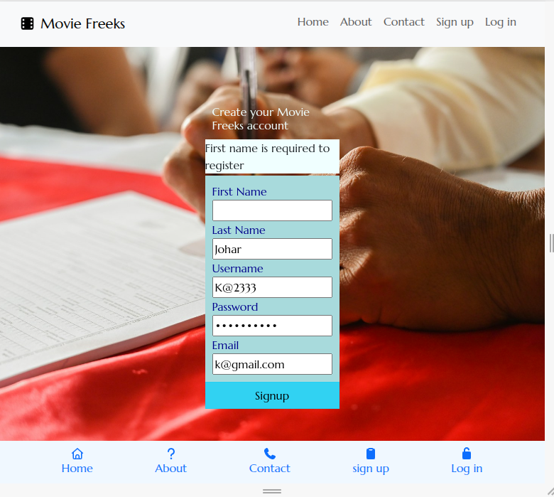
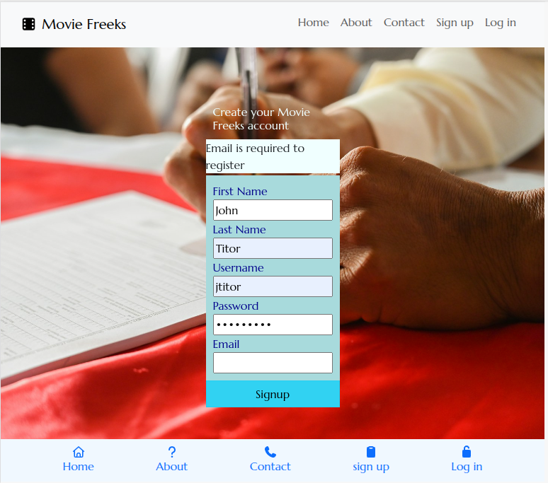
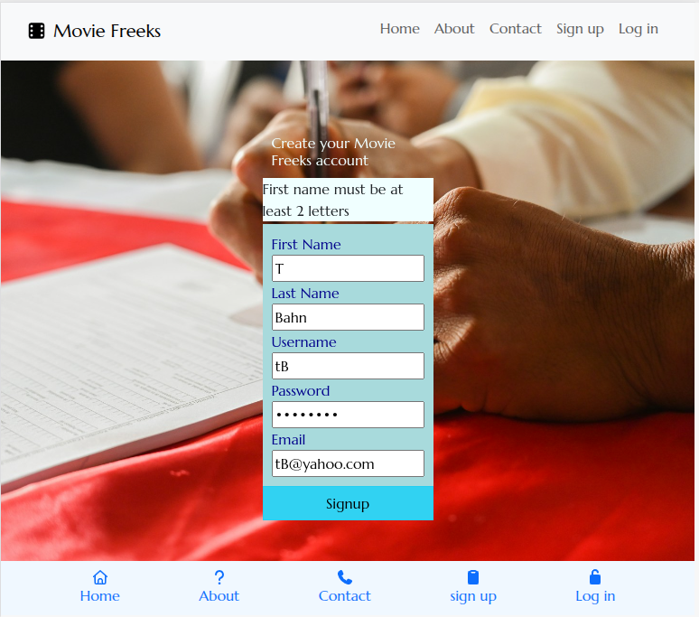
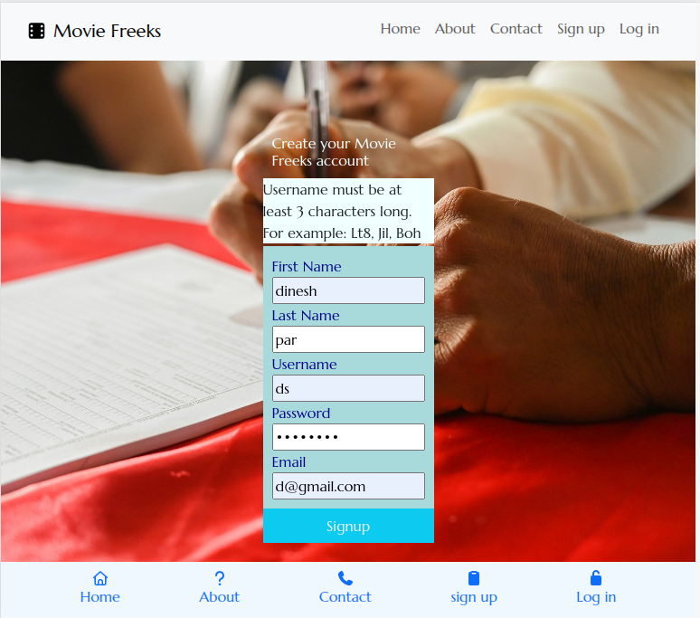

## Software testing and its importance 
Software testing is a vital part of the SDLC (Software Development Life Cycle) that mainly aims to improve sofware quality through thorough tests. 
Testing ensures that:
- The features of the application fuction properly as expected.
- The application is secure. 
- The needs of the business owners or users are met.
- The application provides value to the end users.

Testing helps to:
- Mitigate risks by identifying defects and failures in the early stages of the development process, when they are less expensive to fix.
- Bolsters confidence in knowing that the software application works in the way that was intended before the release.
- Ensure compliance by making sure that the sofware is in line with the standards, regulations and compliance requirements.
- Provide user satisfaction by testing from the perspective of the user to verify the usability, functionality and compatibility of the software.
- Optimize the software by providing vital feedback to continuously improve the quality of the software, the user experience, security, performace, or other factors.
- Reduce the cost of defects found after the release of the software by finding and fixing bugs earlier in the development cycle.

By reading the following source, all of the points above has been made evident: [The Importance of Software Testing](https://www.computer.org/resources/importance-of-software-testing)

## Types of tests
Behaviour Driven Development (BDD) and Test Driven Development (TDD) are both software testing approaches that aim to improve software quality and reliability through a methodology that is centered towards testing the software features beforehand. BDD is more concerned with the behaviour of the software application, while TDD is based on a process of writing the tests even before the code is written. While BDD is a manual testing procedure, TDD is an automatic testing procedure. More can be read about the testing procedures here: [Difference between BDD Vs TDD in Software Engineering](https://www.geeksforgeeks.org/software-engineering/difference-between-bdd-vs-tdd-in-software-engineering/)

For this project, BDD forms the proper testing procedure as:
- The size of the project allows a number of manual tests to be concluded individually.
- This kind of approach helps to test the features in order to ensure that the user expectations can be met.

## Concluded BDD tests
The tests are outlined in scenarios, in which the user goal is defined, and then the situations that follow the user interaction along with the outcome that should occur. They are outlined in the format:
Given - A specific event, such as when the user is logged in.
When - A particular action is carried out, such as clicking the log out button.
Then - A set of observable consequences occur, such as the user has been logged out and the user is shown feedback to confirm that the action has occured.

### Scenario:
The user does not fill in any form fields and clicks the submit button on the form directly 

**Given** the user is on the sign up page, **when** the user accidently cicks on the submit button without filling in form fields, **then** the user is warned that an empty form cannot be submitted.

Expected: The signup form should not allow the user registration to proceed whith an empty form.

Test conducted: Click on the signup button and see whether the warning message successfully pops up on the hint element.

Test result: The test has been concluded with success. When the user attempts to submit an empty form, the user is prompted with a message on the hint element of the form stating that the user cannot sumbit an empty form, as can be seen on the screenshot below.

Empty form submission

### Scenario:
The user does not fill out one field of a form and then clicks on the submit button

**Given** the user is on the signup page, **when** the user accidentally leaves out one field empty, **then** the user is propmpted with a message on the hint element stating that the particular field must be filled in. 

Expected: The user should be warned when a certain form field has not been filled out, and the form is attempted to be submitted

Test conducted: Leave out one particular field on the form and test to see if the warning message shows on the hint element. Repeat the process for each form field left empty, and the others filled in.

Test result: The form has been tested with the first name field empty, and it results in the message displaying in the hint element warning the user of the mistake. The same is for the other form fields that are left unfilled. Test has been concluded to be successful. The screenshots below show each empty field being validated.

First name unfilled

Last name unfilled

Username unfilled

Password unfilled

Email unfilled

## Scenario:
The user inputs only 1 letter as the first name and attempts to submit the form

**Given** the user is on the signup page, **when** the user inputs a single letter as the first name, **then** the user is propmpted with a message on the hint element stating that the first name should be of at least 2 letters. 

Expected: The user should be warned when a first name less than 2 letters is attempted to be entered as the first name. The letters rule owes to the fact that some people may have first names of 2 letters or a short abbreviated form. For example: Bo, Hu, or Md (short abbreviated form for Muhammed). The first name field could have been set to 3 or more than that, but the developer realizes that some poeple may indeed have very short first names, and this pop up prompt acknowledges that fact. With 3 or more characters, the 2 letter names would not be possible to be entered due to the length being less than 3 or so. This can result in major user frustration. The people with short names will not be left out. 

Test conducted: Attempt to enter a first name with 1 letter, and see whether the hint element text pops up warning the user of the name being less than 2 letters.

Test result: The form hint element shows a message letting the user know that at least 2 letters need to be present for the first name. The test has been concluded to be successful, as the screenshot below shows. 

First name less than 2 letters

## Scenario
The user inputs a username that is of less than 3 characters and attemtps to submit the signup form

**Given** the user is on the signup page, **when** the user tries to submit the signup form by inputting a username which is less than 3 characters, **then** the user is propmpted with a message on the hint element stating that the username must contain at least 3 characters.

Expected: The user is shown a warning message when the username field has been entered to be less than 3 characters long, alog with an example of the username that should be entered.

Test conducted: Type in a username less than 3 characters on the username field and test to see whether the warning message shows up on the hint element.

Test result: Attempting to submit the form with the username being less than 3 characters results in the hint element showing the warning message that the username must be of at least 3 characters. An example is also seen on the hint element that makes it clear how long the username should be, and also what kind of username the user can choose to enter. The screenshot below shows the warning prompt on the hint element.

Username less than 3 characters

